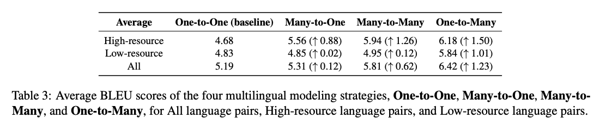
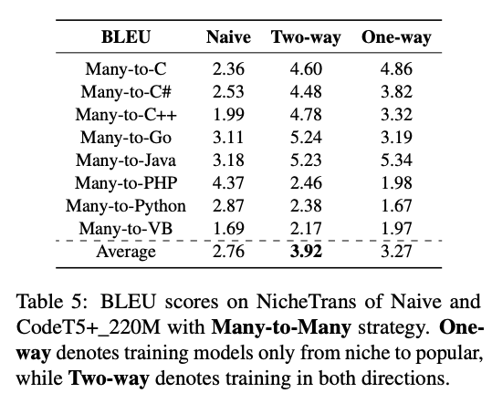
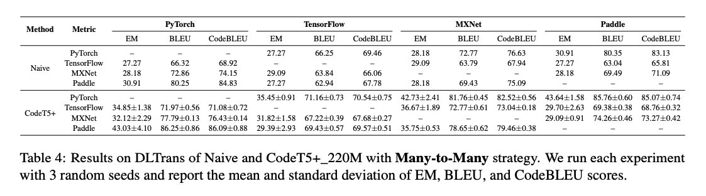

# Experiments based on CodeT5+

We performed all experiments on the CodeT5+ `220M` model.

# How to Use?

## Environment

```bash
conda create -n codetransocean python=3.9
conda activate codetransocean
conda install pytorch==1.13.1 torchvision==0.14.1 torchaudio==0.13.1 pytorch-cuda=11.6 -c pytorch -c nvidia  # Please check your CUDA version.
pip install transformers==4.25.1
pip install datasets
pip install tensorboard
pip install tree_sitter
pip install evaluate
```

## Finetuning & Inference & Evaluation

``` run_preprocess.py ``` is used to pre-process data.

``` run_translation.py ``` is used for training and inference on a specified dataset.

``` run_score.py ```  and ``` evaluator ``` are used to calculate inference results in the BLEU score.

Other ```.sh``` files are used to specify which multilingual modeling methods to use on which datasets to train CodeT5+ and infer.


## Experimental results

<div align="center">
  
  
  
</div>

For more detailed experimental results, please see our paper.
