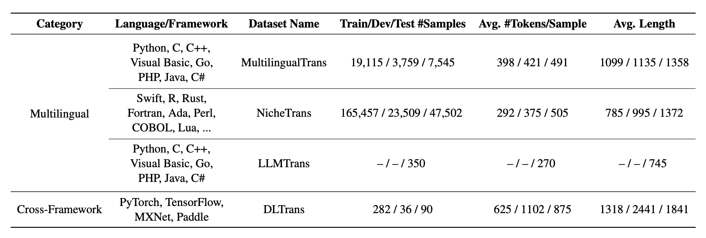

# [CodeTransOcean: A Comprehensive Multilingual Benchmark for Code Translation](https://arxiv.org/abs/2310.04951)

[Leaderboard](https://yuchen814.github.io/CodeTransOcean/) | 📄[Paper](https://arxiv.org/pdf/2310.04951.pdf) | 🤗[Access from HuggingFace datasets](https://huggingface.co/datasets/WeixiangYan/CodeTransOcean) | [Access from Google Drive datasets](https://drive.google.com/file/d/1xw6Edqf_nknKoei_LC49n4EtvNQezKGe/view?usp=sharing)

**CodeTransOcean**, a large-scale comprehensive benchmark that supports the largest variety of programming languages for code translation. CodeTransOcean consists of three novel multilingual datasets, namely, **MultilingualTrans** supporting translations between multiple popular programming languages, **NicheTrans** for translating between niche programming languages and popular ones, and **LLMTrans** for evaluating executability of translated code by large language models (LLMs). CodeTransOcean also includes a novel cross-framework dataset, **DLTrans**, for translating deep learning code across different frameworks.


<div align="center">
  
</div>


## Datasets
🤗[Hugging Face](https://huggingface.co/datasets/WeixiangYan/CodeTransOcean) or  [Google Drive](https://drive.google.com/file/d/1xw6Edqf_nknKoei_LC49n4EtvNQezKGe/view?usp=sharing)


## Code
The MultilingualTrans, NicheTrans, and DLTrans datasets were experimented with on CodeT5+, and the code is in the [CodeT5+](https://github.com/WeixiangYAN/CodeTransOcean/tree/main/CodeT5%2B) file.

The LLMTrans dataset was experimented with on GPT-3.5, and the code is in the [ChatGPT](https://github.com/WeixiangYAN/CodeTransOcean/tree/main/ChatGPT) file.


## Citation
Please cite the paper if you use the data or code from CodeTransOcean.
```
@article{yan2023codetransocean,
  title={CodeTransOcean: A Comprehensive Multilingual Benchmark for Code Translation},
  author={Yan, Weixiang and Tian, Yuchen and Li, Yunzhe and Chen, Qian and Wang, Wen},
  journal={arXiv preprint arXiv:2310.04951},
  year={2023}
}
```

## Contact
For questions, please feel free to reach out via email at ``yanweixiang.ywx@gmail.com``.
